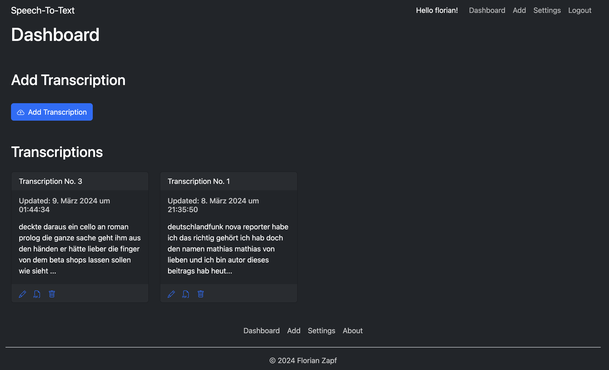
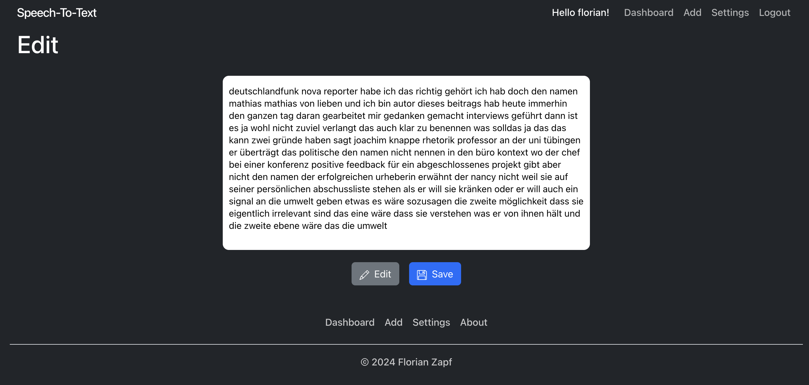
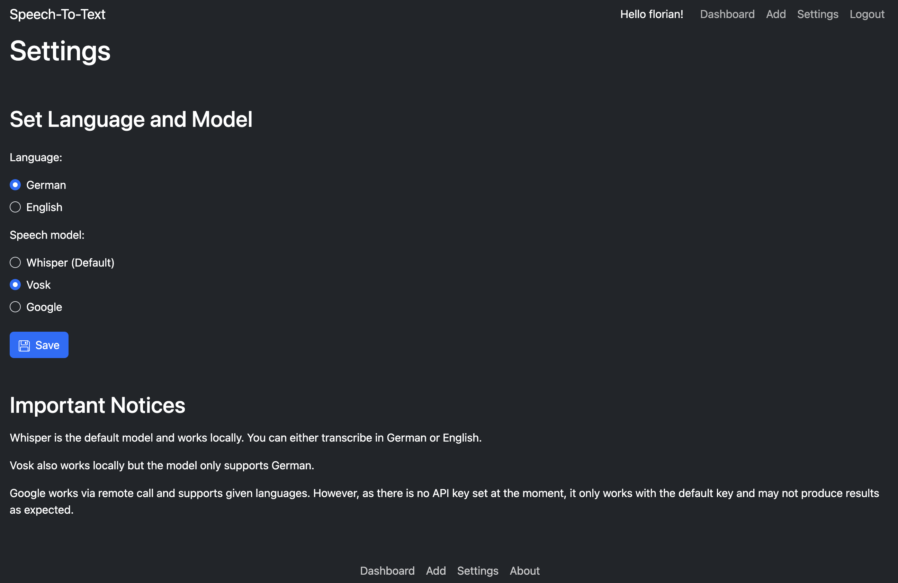

# Speech to Text Web App

Speech to Text Web App...

## About

This is a web app that allows users to record audio and convert it to text. 
The app is built with Python / Django and React using several libraries.

## Run locally with Docker

You may use sudo before commands if you are not in the docker group.

#### 1. Clone the repository and cd into directory

```sh
$ git clone https://github.com/thascius-rumpelschnick/speech-text-web-app.git
$ cd speech-text-web-app
```
#### 2. Add .env.dev file

Look at the `.env.example` file and create a `.env.dev` file with the same variables.
Or see [here](./docs/todo.md) for a starter and search for heading Dev Environment.

#### 2. Build frontend assets

```sh
$ docker-compose run --rm node sh -c "npm i && npm run build-dev"
```
#### 3. Load Vosk model

```sh
$ docker-compose run --rm python sh -c "python manage.py load_vosk_model -m vosk-model-small-de-0.15"
```

#### 4. Start database and make migrations

```sh
$ docker-compose up -d postgres
$ docker-compose run --rm python sh -c "python manage.py migrate"
```

#### 5. Start application as whole

```sh
$ docker-compose up -d postgres python
```

#### 6. Stop application

```sh
$ docker-compose down
```
You can now access the web application at [http://localhost:8000](http://localhost:8000).

After you are done with steps 1 to 4 for the first time, you just need to run steps 5 & 6 from then on.

## Screenshots








## Author

Florian Zapf

## Docs

1. [Development](./docs/development.md)
2. [ToDo's](./docs/todo.md)
