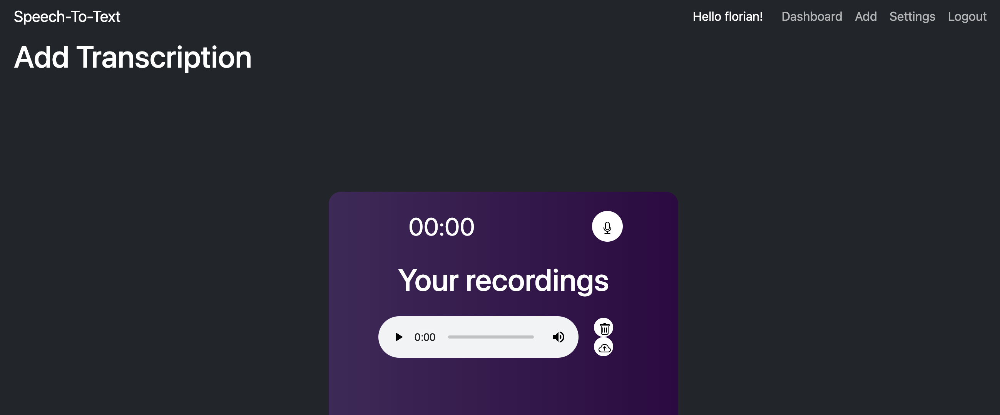

# Speech to Text Web App

Speech to Text Web App...

## About

This is a web app that allows users to record audio and convert it to text. 
The app is built with Python / Django and React using several libraries.

## Run locally with Docker

### 1. Clone the repository and cd into directory
```bash
$ git clone https://github.com/thascius-rumpelschnick/speech-text-web-app.git

$ cd speech-text-web-app
```
### 2. Add .env file

Look at the .env.example file and create a .env file with the same variables.
Or see [here](./docs/todo.md) for a starter and search for Dev Environment.

### 2. Build frontend assets
```bash
$ docker-compose run --rm node npm run build
```
### 2. Run migrations and load Vosk model
```bash
$ docker-compose run --rm python manage.py migrate

$ docker-compose run --rm python manage.py load_vosk_model
```

## Screenshots





## Author

Florian Zapf

## Docs

1. [Development](./docs/development.md)
2. [ToDo's](./docs/todo.md)
